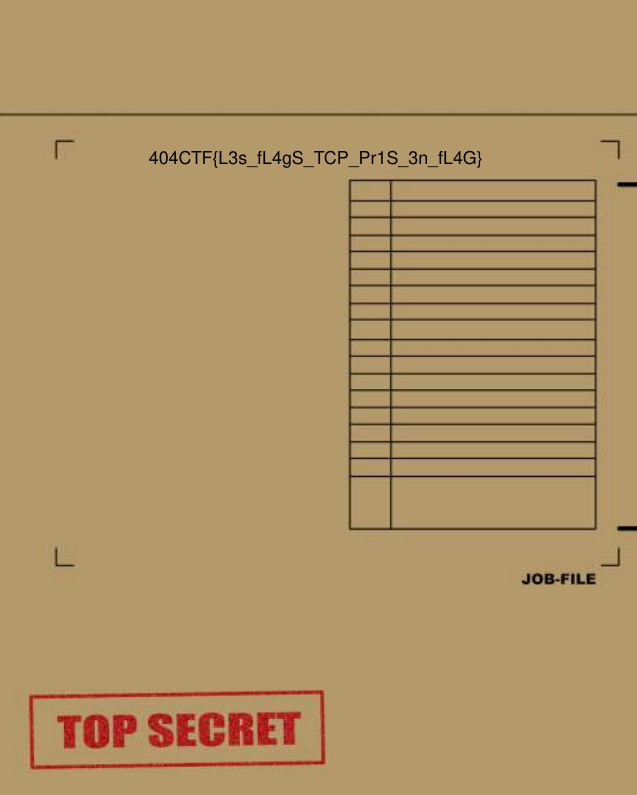

# Hackllebarde ransomware
This is a series of four challenges.

## TCP Analysis
For the first part, we have a PCAP file with a weird trafic recorded on the victim computer. It mostly contains TCP packets, with weird TCP flags and no data.
Then, I found out that TCP flags correspond to ASCII characters! So with the python script `data/extract_tcp_flags.py`, I recovered the flags and got the PDF file `data/flag1.pdf` with the flag inside!


## Dump Amalysis
In this second part, we haave a memory dump of the victim computer and we are looking for information about a malicious binary file, a remote ip, a local port and a website.
I used `volatility` for that, but I found out that this dump is from a Linux machine. We need to generate the profile with the right OS/Kernel to continue with `volatility`.

To generate the profile, I used [this amazing blog](https://heisenberk.github.io/Profile-Memory-Dump/) that describe the process. 

Let's grab the OS/Kernel of our memory dump:
```bash
$ strings dumpmem.raw | grep -i 'Linux version' | uniq
Linux version 5.4.0-107-generic (buildd@lcy02-amd64-070) (gcc version 7.5.0 (Ubuntu 7.5.0-3ubuntu1~18.04)) #121~18.04.1-Ubuntu SMP Thu Mar 24 17:21:33 UTC 2022 (Ubuntu 5.4.0-107.121~18.04.1-generic 5.4.174)
```

So I download Ubuntu-18.04, install it on a VM, and upgrade the Kernel to the 5.4.0-107 version. Then, I generated my profile, the `data/Ubuntu-18.04-5.4.0-107-generic.zip` file.

Now, I run a bunch of `volatility` commands, such as `pstree`, `pslist`, `netstat`. The output of those command are available in the `data/*.vol` files. I spotted a weird executable in `pstree`:

```
...bash              2627            1000           
....JeNeSuisPasDuTo  2645            1000           
.....sh              2646            1000           
......nc             2647            1000     
```

We can see that the file `JeNeSuisPasDuToutUnFichierMalveillant` (the full name), started from `bash`, is the parent of a `sh` process and a `nc` process. It sounds like some data is exfiltrated here through `nc`.
So, I checked in `netstat`, and we see that, with the `nc` PID 2647, there is some activity in the network. A connection is established between the local `nc` and a remote IP.

```
TCP      0.0.0.0         :13598 0.0.0.0         :    0 LISTEN                         nc/2647 
TCP      192.168.61.2    :13598 192.168.61.137  :38088 ESTABLISHED                    nc/2647 
```

So far so good ! We have now the filename `JeNeSuisPasDuToutUnFichierMalveillant`, the remote IP `192.168.61.137` and the local port `13598`. 
For the website, I started with this easy trick, which outputs a lot of results
```bash
strings dumpmem.raw | grep https://
```
But with a little work of filtering and patience, I finally found [this youtube video](https://www.youtube.com/watch?v=3Kq1MIfTWCE) within the links, that sounds very good.

So finally, we got this flag!
```404CTF{192.168.61.137:13598:JeNeSuisPasDuToutUnFichierMalveillant:https://www.youtube.com/watch?v=3Kq1MIfTWCE}```
