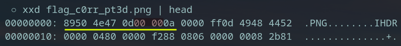
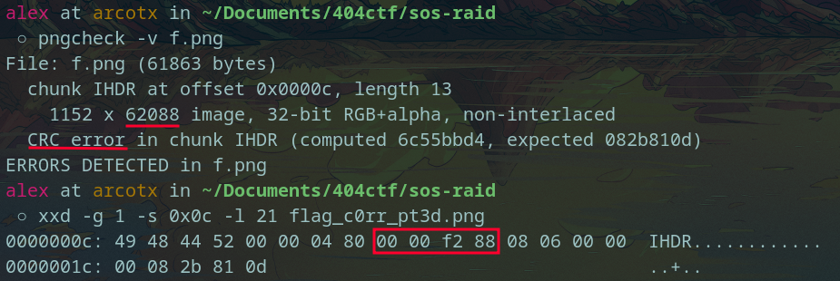

# SOS RAID
This challenge was in two parts.
- The first one was the recovery of a RAID5 disk.
- The second one was the correction of a corrupted PNG file.

## RAID5 recovery
At the beginning of the challenge, we have two disks, `disk0.img` and `disk1.img` and a `manuel.txt` file with some information about those disks.
We learn that those disks come from a RAID5, with a block size of 1 byte.
RAID5 require at least 3 disks, some I assume that we miss the third one. Let's recover it !

I write a python script `recover.py` to do so. It's just xoring the 2 disks to recover the third and then taking the non parity bytes to get the file.
I recognize the `PK\x03\x04` magic bytes at the beginning of the file, that confirm me I recovered a ZIP file.

Then, we unzip it and find a `flag.txt` with the first flag!
```404CTF{RAID_5_3st_p4s_tr3s_c0mpl1qu3_1abe46685ecf}```

## PNG Correction
Let's work on the `flag_c0rr_pt3d.png` file now. Of course, it is corrupted we can't open it.
First reflex: let's see the magic bytes. PNG files begins with `89 50 4E 47 0D 0A 1A 0A` according to [Wikipedia](https://en.wikipedia.org/wiki/List_of_file_signatures)
My file starts with:

So I corrected this first error with `hexedit`.

But it was not enough. I still can't open the image.
So I used `pngcheck` to 'debug' the PNG file.

The first error was the bad length of the IHDR chunk:
```chunk IHDR at offset 0x0000c, length 65293:  invalid length```
After some research on the web, I found out that the length of this chunk should be `0x0d` and not `0xff0d` according to the file.
So I corrected these bytes with hexedit.

Then when reusing `pngcheck`, I got another error:

Mmm, a bit must have been flipped, either in the IHDR header or in the checksum.
So I checked the [IHDR Image Header](http://www.libpng.org/pub/png/spec/1.2/PNG-Chunks.html) and I found out what was the format of this IHDR chunk. The height of this image was weird so I assumed that a bit must have flip here.
After a few try with `hexedit`, I corrected the flipped bit, which was the `0xf2` instead of `0x02`

Finally, last but not least, `pngcheck` throwed me a last error, which was the following:
```chunk IEND at offset 0x0f19f, length 173:  EOF while reading data```
My file was looking for a 173 length chunk at the end of the file, which was weird. I checked on another PNG file what was the IEND regular IEND length, and found out it was 0. So, back to `hexedit`, I corrected the `ad` length of this chunk with `00` and now ... it worked !
We are now able to read the PNG file and to get the flag !
